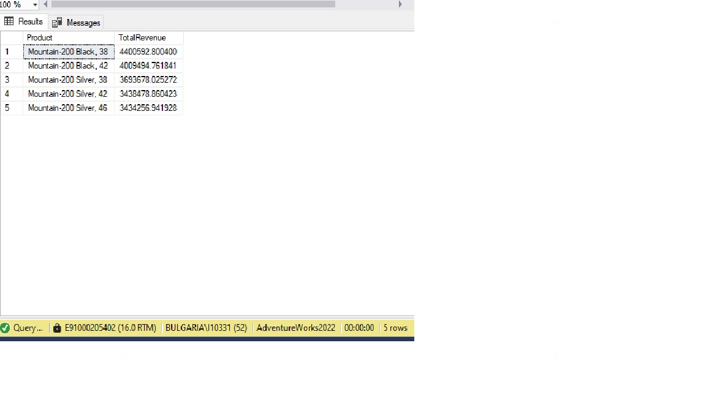
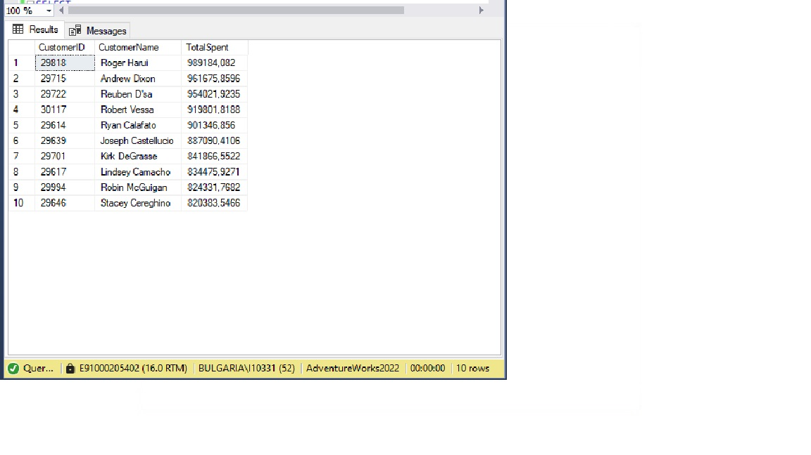
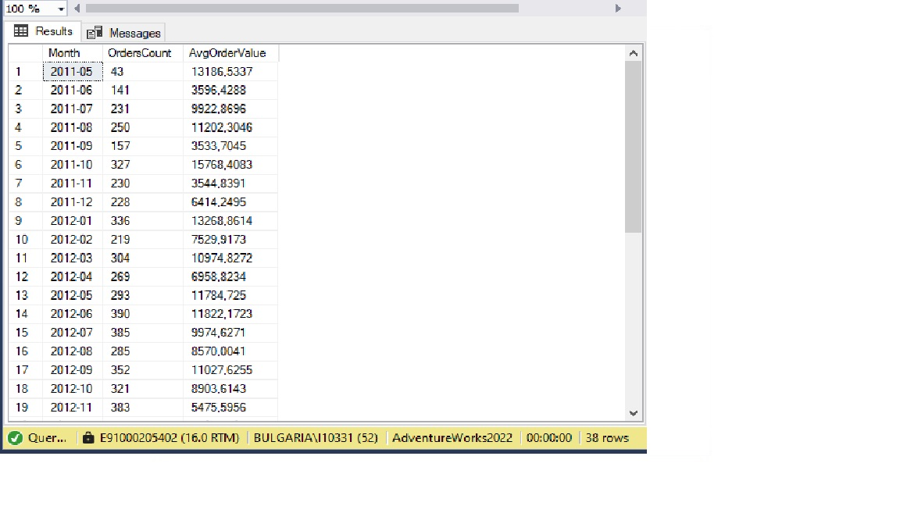
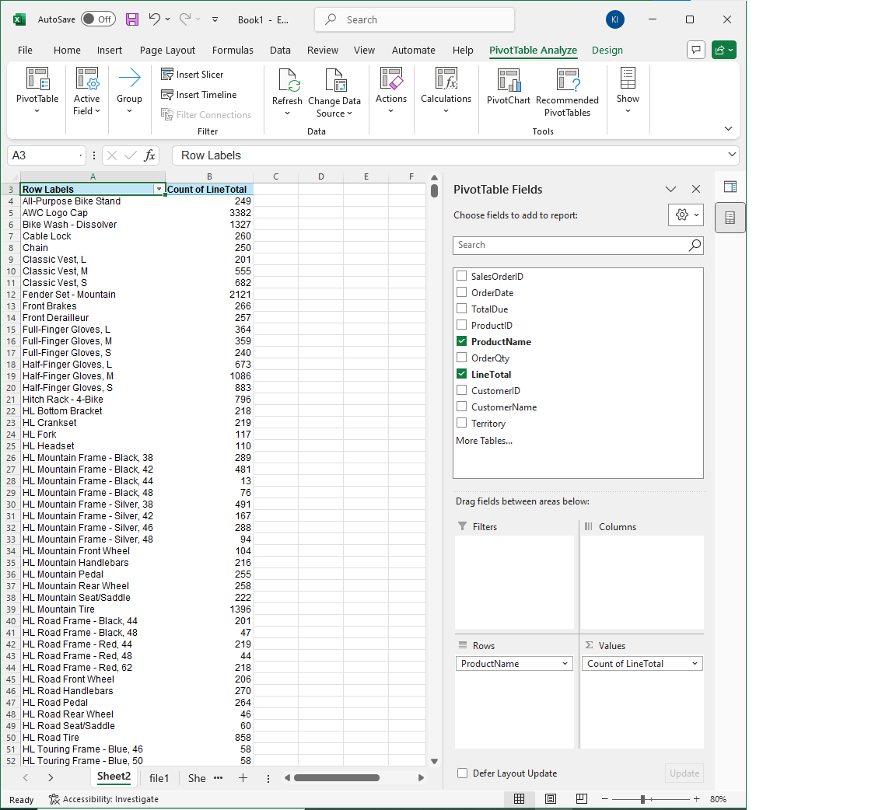
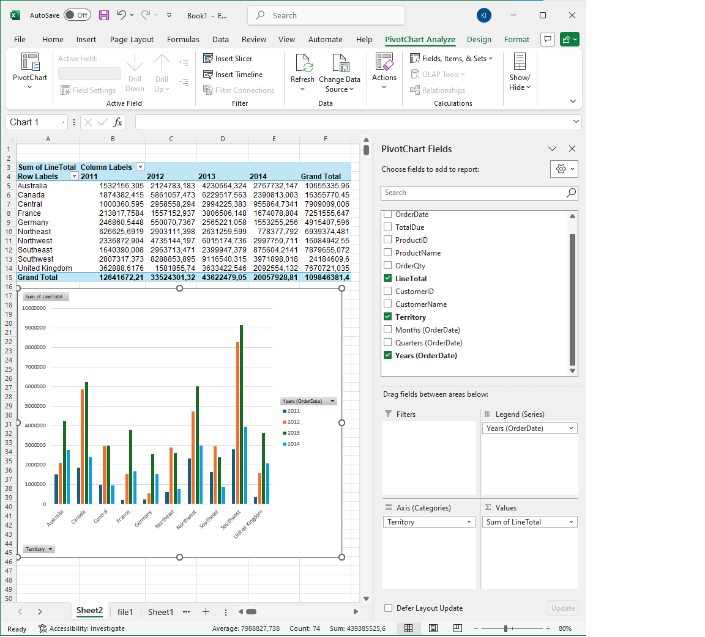
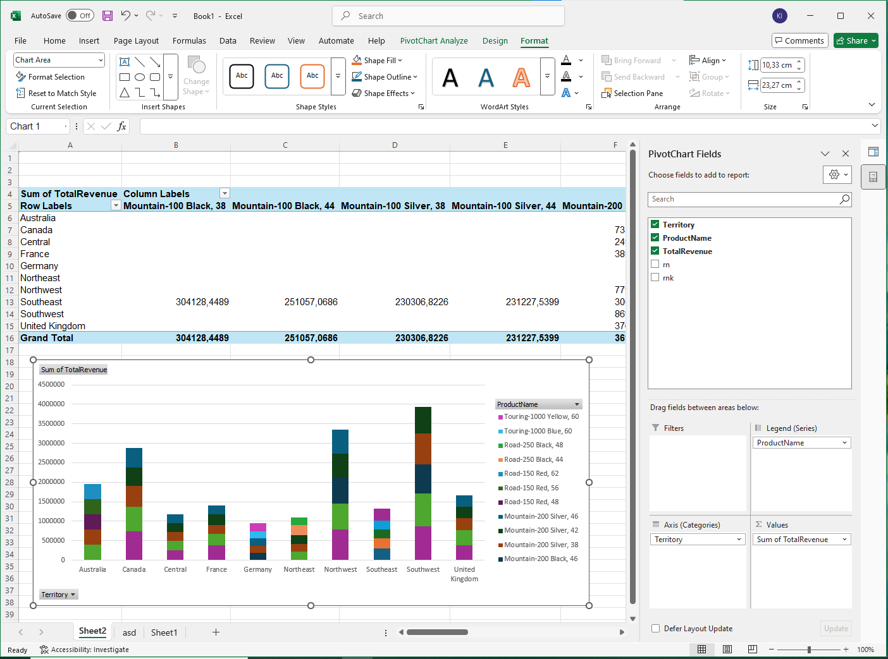

AdventureWorks Sales Analysis

Project Overview
This project analyzes sales data from the AdventureWorks2022 database using T-SQL. It focuses on extracting key insights about products, customers, and sales territories by creating views, analytical queries, stored procedures, and performance optimizations.

Technologies Used
- Microsoft SQL Server 2022
- SQL Server Management Studio (SSMS)
- T-SQL

File Structure
create_view.sql -- Sales summary view
analysis_queries.sql -- Analytical queries for reporting
sales_procedure.sql -- Stored procedure with parameters
indexes_and_optimization.sql -- Index creation and performance analysis

How to Use

1. Restore the `AdventureWorks2022` database on your SQL Server.
2. Run `create_view.sql` to create the base view for analysis.
3. Use `analysis_queries.sql` to generate reports by product, region, and customer.
4. Run `advanced_analysis.sql` for advanced analytics such as territory revenue and top customers.
5. Execute `sales_procedure.sql` to create a reusable procedure for top product revenue.
6. Test performance in `indexes_and_optimization.sql` using `STATISTICS IO` and `TIME`.

Key Concepts Practiced
- Complex joins between sales, customers, and product tables
- Reusable views for cleaner querying
- Aggregation and filtering for business reporting
- Stored procedures with input parameters
- Performance tuning using indexes and query statistics
- Time-based reporting and ranking

Advanced Analysis Queries (`02b_advanced_analysis.sql`)

This file contains advanced analytical queries on the AdventureWorks2022 database to extract deeper business insights:

- Revenue by Sales Territory: Summarizes total sales revenue grouped by geographic territories.
- Top 5 Best-Selling Products: Lists the top 5 products ranked by total revenue generated.
- Top 10 Customers by Spending: Identifies customers with the highest total purchases.
- Monthly Average Order Value: Calculates average order value for each month, showing sales trends over time.

These queries complement the base analysis and demonstrate skills in aggregation, ranking, and time-based reporting.

Sample Outputs
Below are example results from running some of the key SQL queries in this project. These screenshots demonstrate the insights extracted from the AdventureWorks2022 database.

The following screenshot shows two result sets:

Total Revenue by Sales Territory: This part of the query summarizes the total sales revenue grouped by sales territories, helping to identify strong-performing regions.
Top 5 Best-Selling Products: The second part lists the five products that generated the highest revenue overall.

These insights are useful for regional performance tracking and product-level sales strategy.

.jpg)

Top 5 Best-Selling Products

This query lists the five products generating the highest revenue.

---

Top 10 Customers by Spending

This query identifies the top 10 customers based on total purchase amount.

---

Monthly Average Order Value

This query calculates average order value per month to show sales trends over time.

Excel: Your first analysis

Excel: Total Revenue by Year and Territory

SQL + Excel: Top 5 Products by Revenue per Territory

This analysis uses SQL window functions (ROW_NUMBER and RANK) to find the top 5 products with the highest revenue in each sales territory. The results were exported to Excel for further visualization.

Ivan Kolev
